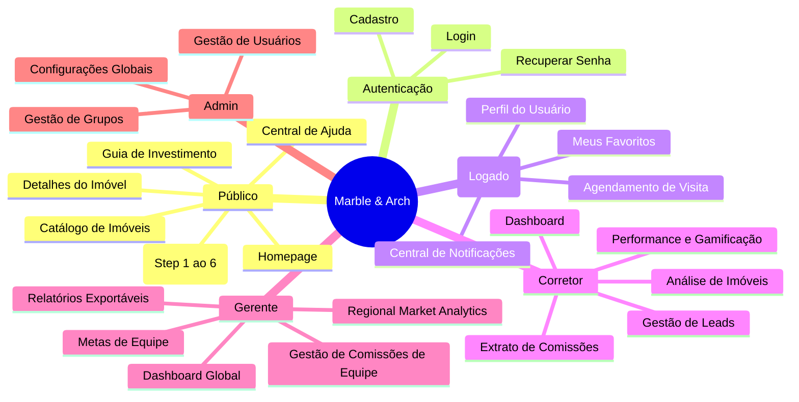
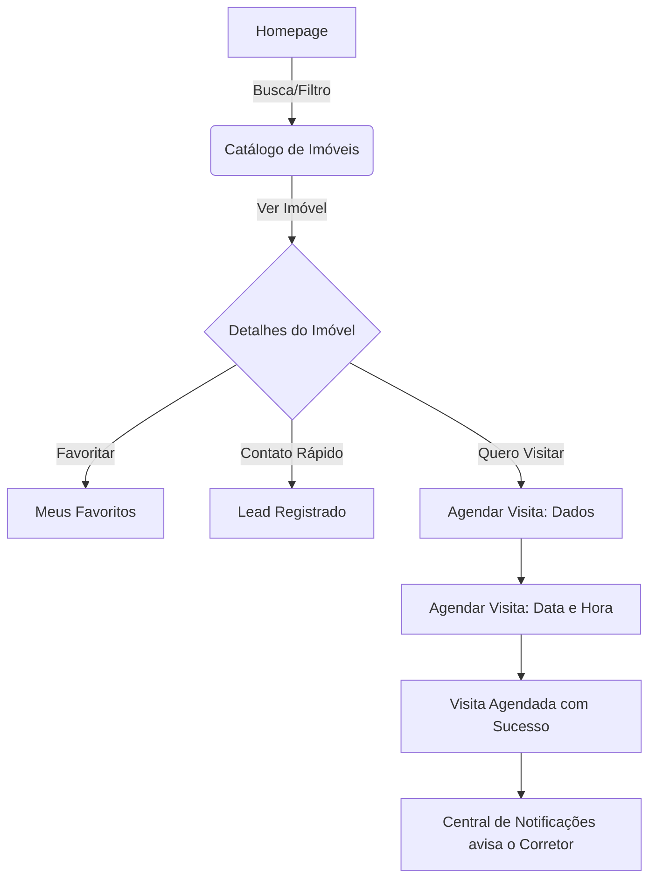
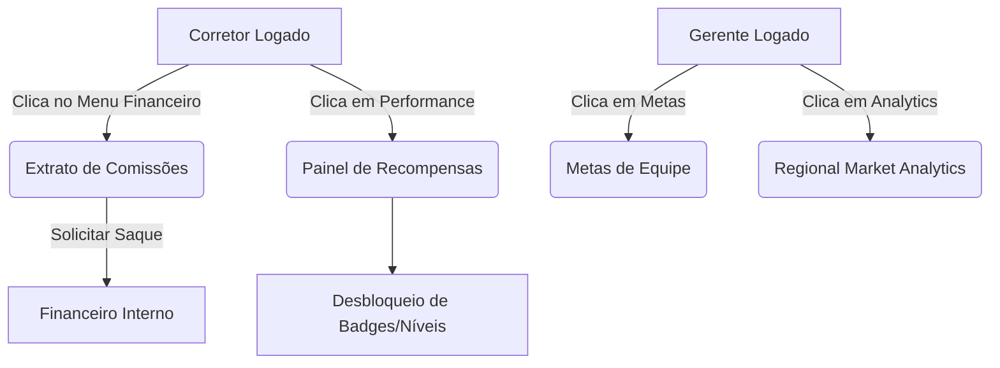

# Marble & Arch — UX Flows e Sitemap

> **Versão:** 2.0 (Revisão Stitch/Figma)  
> **Data:** 2026-06-11  

---

## 1. Sitemap Consolidado

A plataforma agora conta com navegação pública, área autenticada do cliente (CRM), e toda a operação imobiliária (Dashboards).

---

## 2. Fluxo Principal: Navegação e Agendamento do Cliente

O fluxo mais importante do cliente agora termina na conversão ativa: o **Agendamento de Visitas**.

---

## 3. Fluxo Financeiro e Gamificação (Corretor / Gerente)

A nova jornada do corretor expandiu de apenas analisar imóveis para também gerenciar sua própria vida financeira e metas.

---

## 4. Requisitos de Interface (Baseado nas Telas do Stitch)

### Header e Navegação
- **Estado Público:** Logo na esquerda. Links centrais: "Comprar", "Alugar", "Anunciar Imóvel", "Ajuda". Direita: Botão secundário "Entrar" e primário "Criar Conta".
- **Estado Autenticado (Cliente):** Adiciona ícone de "Sino" (Notificações) e "Coração" (Favoritos). Avatar do usuário abrindo dropdown (Perfil, Sair).
- **Estado Autenticado (Corretor/Gerente):** Sidebar de navegação profunda contendo módulos de Leads, Imóveis, Financeiro, Analytics, Configurações.

### Modais e Drawers
- Utilizar os componentes do `Nuxt UI Pro` como `<USlideover>` para filtros no catálogo em dispositivos móveis.
- O Quick View de imóveis no catálogo deve utilizar `<UModal>`.
- Todos os relatórios exportáveis e extratos de comissões devem ser exibidos dentro de tabelas responsivas `<UTable>`.
