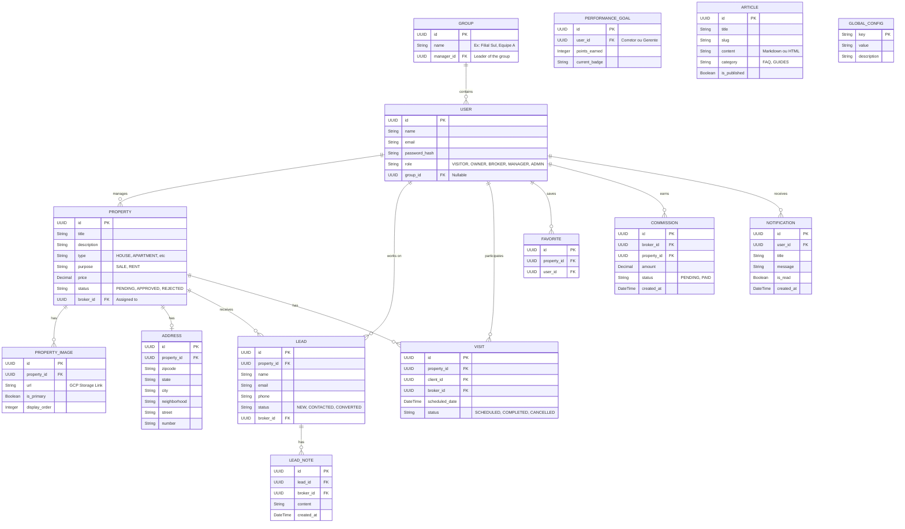

# Marble & Arch — Arquitetura de Software

> **Versão:** 2.1 (Revisão Completa de Entidades)  
> **Data:** 2026-06-11  

---

## 1. Topologia do Sistema (Monorepo)

O projeto é estruturado em um monorepo para facilitar o desenvolvimento, deploy e garantir o uso correto do Docker local. O repositório contém dois diretórios principais:

```
marble-and-arch/
├── frontend/             # Aplicação Nuxt 3 (UI + Nitro Proxy)
│   ├── app/              # Componentes, Páginas, Composables
│   └── nuxt.config.ts    # Configurações do Nitro
│
├── backend/              # Aplicação Spring Boot (API Java 24)
│   ├── src/main/java/    # Código fonte (Domain Driven Design)
│   └── pom.xml           # Dependências
│
└── docker-compose.yml    # Orquestrador local
```

## 2. Padrão de Comunicação (BFF Proxy)

O frontend Nuxt não faz chamadas diretas para o backend a partir do client-side. Ele utiliza a engine **Nitro** como um Backend-for-Frontend (BFF).

1. O navegador faz requisições para `/api/...` no Nuxt.
2. O Nuxt Nitro intercepta e faz o proxy para `http://backend:8081/api/...`.
3. Evitamos problemas de CORS e mantemos tokens de acesso seguros no cookie `HttpOnly`.

---

## 3. Arquitetura de Dados (Diagrama de Entidades Estendido)

Para suportar exaustivamente todos os endpoints definidos na API e no PRD (como artigos de ajuda, imagens de imóveis, anotações de leads e hierarquia de times), o modelo de dados completo é:



---

## 4. Stack Tecnológico Base

### Frontend (Diretório `frontend/`)
- **Framework:** Nuxt 3 (Vue.js 3)
- **UI Component Library:** Nuxt UI Pro v4.8.2
- **Estilização:** Tailwind CSS (Variáveis de CSS no `main.css`)
- **Estado:** Pinia

### Backend (Diretório `backend/`)
- **Linguagem:** Java 24
- **Framework:** Spring Boot 3.4.7
- **Banco de Dados:** PostgreSQL 16
- **Autenticação:** Spring Security + JWT
- **Migrações:** Flyway ou Liquibase

### Infraestrutura
- Docker & Docker Compose para desenvolvimento local.
- GCP Cloud Storage para Imagens e Arquivos.
